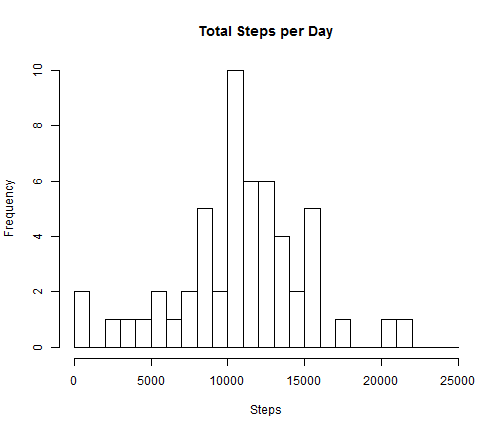
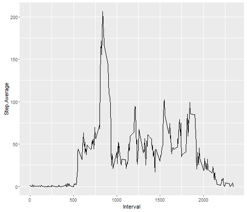
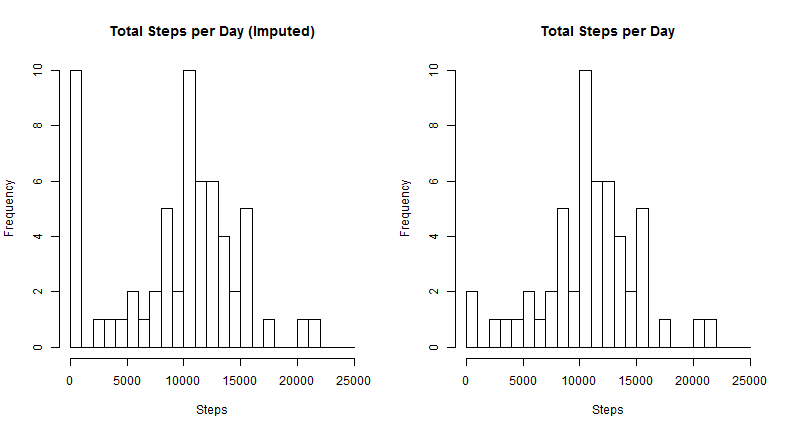
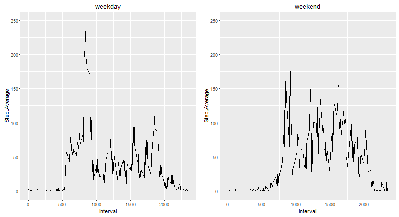

Statistics on Activity Data (Reproducible Research - Week 2)
========================================================

This is the R Markdown document for the Programming Assignment of Week 2 of the Reproducible Research module

#### Load necessary libraries

```r
library(lubridate)
library(ggplot2)
library(dplyr)
library(Hmisc)
library(plyr)
library(gridExtra)
```

#### Load the Activity data and add date column with Date type

```r
activityData <- read.csv("./Activity Data/activity.csv")
dateNew <- ymd(activityData$date)
activityDataExtended <- data.frame(activityData, date1 = dateNew)
```

#### Sum up the total steps per day 

```r
totalStepsDay <- aggregate(activityDataExtended$steps ~ activityDataExtended$date1, FUN = sum, na.rm = TRUE)
colnames(totalStepsDay) <- c("date", "steps")
```

#### Plot histogram of the Total Steps per Day

```r
hist(totalStepsDay$steps, breaks=seq(0,25000,by=1000), main="Total Steps per Day", xlab="Steps")
```



#### Code for mean and median calculation

```r
options(scipen=999)
round(mean(totalStepsDay$steps), digits=2)
median(totalStepsDay$steps)
```

### Mean is 10766.19 steps per day and the Median is 10765 steps per day

#### Calculate the average steps per interval over all days

```r
avg5MinuteIntervals <- aggregate(activityDataExtended$steps ~ activityDataExtended$interval, FUN = mean, na.rm = TRUE)
colnames(avg5MinuteIntervals) <- c("Interval", "Step.Average") 
```

#### Time series of Intervals vs Step Average per interval over all days

```r
ggplot( data = avg5MinuteIntervals, aes( Interval, Step.Average )) + geom_line() 
```



#### Find Interval with maximum number of steps

```r
maxInterval <- avg5MinuteIntervals %>% filter(Step.Average == max(Step.Average)) 
```
### Interval 835 has maximum number of steps on average

#### Number of rows with NA (in the steps)

```r
sum(is.na(activityData$steps)) 
```

```
## [1] 2304
```

#### Impute the NA values in the steps column of the dataset. The mechanism is to replace NA values with the median of steps of the respective day. If all intervals of a day have only NA step values then these will be replaced by 0. New dataset (activitydataSubsetImputed) created with the NA values imputed 

```r
days <- seq(from=as.Date("2012-10-01"), to=as.Date("2012-11-30"),by='days' )
activitydataSubsetImputed <- data.frame()
for ( i in seq_along(days) )
{
    dataSubset <- subset(activityDataExtended, activityDataExtended$date1 == days[i])
    if (any(is.na(dataSubset$steps)))
    {
      dataSubset$imputed_steps <- with(dataSubset, impute(steps, 0))
    }
    else
    {
      dataSubset$imputed_steps <- with(dataSubset, impute(steps, median))
    }
    activitydataSubsetImputed <- rbind(activitydataSubsetImputed, dataSubset)
}
```

#### Calculate the total steps per day including the imputed data

```r
totalStepsDayImputed <- aggregate(activitydataSubsetImputed$imputed_steps ~ activitydataSubsetImputed$date1, FUN = sum, na.rm = TRUE)
colnames(totalStepsDayImputed) <- c("date", "steps")
```

#### Plot histogram for total steps per day with imputed data and without imputed data

```r
par(mfrow=c(1, 2))
hist(totalStepsDayImputed$steps, breaks=seq(0,25000,by=1000), main="Total Steps per Day (Imputed)", xlab="Steps")
hist(totalStepsDay$steps, breaks=seq(0,25000,by=1000), main="Total Steps per Day", xlab="Steps")
```



#### Code for mean and median calculation including the imputed data

```r
options(scipen=999)
round(mean(totalStepsDayImputed$steps), digits=2)
median(totalStepsDayImputed$steps)
```

### Mean is 9354.23 steps per day and the Median is 10395 steps per day

### The median and mean differ from the first assessment without the imputed data. The mean is more heavily affected 10766.19 vs 9354.23 since there is a number of days where no steps have been recorded. Since these days are being set to 0 steps, they have a considerable impact on the calculation of the mean in terms of lowering the mean. While the median also is affected 10765 vs 10395, it has been less impacted and thus is the better "average" for the dataset with the imputed data 

#### Add column for distinguishing weekday and weekend for the date in the dataset and make the column a factor variable. This considers German and English computer settings 

```r
if (weekdays(as.Date(today())) %in% c("Montag", "Dienstag", "Mittwoch", "Donnerstag", "Freitag", "Samstag", "Sonntag")) {
  activitydataSubsetImputed$week_period <- ifelse(!weekdays(activitydataSubsetImputed$date1) %in% c("Samstag", "Sonntag"),"weekday", "weekend")
} else {
  activitydataSubsetImputed$week_period <- ifelse(!weekdays(activitydataSubsetImputed$date1) %in% c("Saturday", "Sunday"),"weekday", "weekend")
}
activitydataSubsetImputed$week_period <- as.factor(activitydataSubsetImputed$week_period)
```

#### Calculate the average steps per interval over all days separated out by weekday or weekend

```r
avg5MinuteIntervalsWeekDays <- aggregate(activitydataSubsetImputed$steps ~ activitydataSubsetImputed$interval+activitydataSubsetImputed$week_period, FUN = mean, na.rm = TRUE)
colnames(avg5MinuteIntervalsWeekDays) <- c("Interval", "Week.Period", "Step.Average")
```

#### Plot time series for total steps per day separated by weekday and weekend

```r
plot1 <- ggplot( data = subset(avg5MinuteIntervalsWeekDays, avg5MinuteIntervalsWeekDays$Week.Period == "weekday"), aes(Interval, Step.Average)) + geom_line() + ylim(0, 250) + ggtitle("weekday")
plot2 <- ggplot( data = subset(avg5MinuteIntervalsWeekDays, avg5MinuteIntervalsWeekDays$Week.Period == "weekend"), aes(Interval, Step.Average )) + geom_line() + ylim(0, 250) + ggtitle("weekend")
grid.arrange(plot1, plot2, ncol=2, nrow = 1)
```


